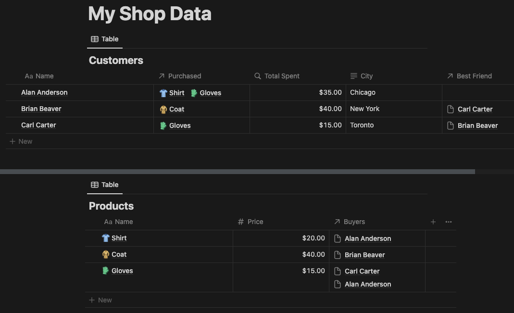

# Notion

This is a GPTScript tool for querying [Notion](https://notion.so) workspaces. It will not add or modify any data in the
workspace. It is read-only.

The tool can search for pages and databases by title, to retrieve the contents of pages, and to retrieve the
contents of databases.

## Setup

In order to use this tool, you will need to [set up a Notion integration](https://www.notion.so/my-integrations).
Name it whatever you would like and assign it to the correct workspace. The "Internal Integration Secret" that you will
get from it is your API key. Set this to the environment variable `GPTSCRIPT_NOTION_TOKEN`.

Under the Capabilities settings for the integration, give it `Read content` at a minimum. (You can disable `Update
content` and `Insert content`, as the tool does not need these permissions.) It will work without any access to user
information, but whenever users are mentioned inside a database or page, the information may not be displayed
properly if the integration does not have permission to read user information.

## Example

Assuming this database layout:



```
tools: github.com/g-linville/notion

How many people bought gloves, and who were they? What cities do they live in? Who are their best friends?
```

Response:

```
Two people bought gloves: Carl Carter and Alan Anderson.

- Carl Carter lives in Toronto, and his best friend is Brian Beaver.
- Alan Anderson lives in Chicago, and he does not have a best friend listed.
```

## License

Copyright (c) 2024 [Acorn Labs, Inc.](http://acorn.io)

Licensed under the Apache License, Version 2.0 (the "License");
you may not use this file except in compliance with the License.
You may obtain a copy of the License at

[http://www.apache.org/licenses/LICENSE-2.0](http://www.apache.org/licenses/LICENSE-2.0)

Unless required by applicable law or agreed to in writing, software
distributed under the License is distributed on an "AS IS" BASIS,
WITHOUT WARRANTIES OR CONDITIONS OF ANY KIND, either express or implied.
See the License for the specific language governing permissions and
limitations under the License.
